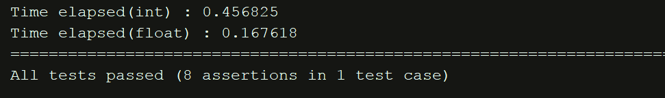

### 2017

# MiniSQL 详细设计报告

组员&队长：郝翔鹏 3150102255

### HAO XIANGPENG


## Table of Contents

- Setup Guide 编译指南
   - 注意事项
   - CMakeLists 的一些亮点
- Interpreter 解释器
   - Lexer词法分析器
   - Parser语法分析器
   - Driver 模块
- API 应用程序接口
- Index Manager 索引
   - B Tree 本身实现
   - B Tree 与文件结合
- File(Buffer) Manager 缓冲管理
- Record & Catalog Manager
   - Record Manager 记录管理
   - Catalog Manager 类别管理
- Tests测试方案
   - Unit Test单元测试
   - Benchmark Test 性能测试

## Setup Guide 编译指南

### 注意事项

1. 本项目使用了Flex + Bison 作为语法分析器和词法分析器的生成工具，因此依赖这两个工
    具。
    其中Bison 的版本需要大于3. 0 ，因为低于这个版本的Bison生成的C++ 代码存在一些已知
    的issue。在大多数的Linux发行版中，Bison已经预装并且版本大于3. 0 （比如Ubuntu
    16. 04 LTS和Arch Linux），如果你是用的是CentOS，可能可以考虑更换发行版。
2. 项目的默认编译工具是 cmake，已经提供可以使用的 cmakelists.txt 文件，如果环境正确，
    可以直接编译。其中对于Interpreter还单独提供了Makefile，但这个版本不保证能够无
    bug 运行。
3. 如果你在Windows下编译，请使用MinGW 或者Cygwin 等工具，不保证msvc能够编译通
    过。同时需要手动安装 flex 和 bison，并且将正确的头文件放入相应工具链的 include 文件
    夹中。
4. 使用了Catch作为测试框架，为了便于编译，已经将源代码放在tests/cach.hpp，这些代码
    全部是catch作者的功劳，本项目只是引用它来做测试，是便于开发的工具，事实上也与
    MiniSQL本身无关。如有查重，还请留意。
5. 项目开发环境：Windows 10 1703 + MinGW + WSL(Ubuntu 16.04 LTS)。

### CMakeLists 的一些亮点

#### 由于项目庞大，各个模块错综复杂，交替引用，还引入了第三方库，如果每次都手动编译肯定不现实。即使使用常规的编译手段，也会因为反复编译而浪费大量时间。因此在 CMakeLists 中将不同的模块生成为不同的lib，然后对不同的模块测试时，只需要编译已经修改过的模块，然后将未修改的模块链接起来即可。如下所示：

```cpp add_library(lib_tree src/IndexManager/BTree.h src/IndexManager/BTree.cpp)

add_library(lib_catch tests/test_catch.cpp)

add_library(lib_catalog src/CatalogManager/Catalog.cpp

src/CatalogManager/Catalog.h)

add_library(lib_file_handler src/BufferManager/FileHandler.cpp
src/BufferManager/FileHandler.h)

add_library(lib_buffer src/BufferManager/BufferBlock.cpp

src/BufferManager/BufferBlock.h)

add_library(lib_record src/RecordManager/Record.cpp

src/RecordManager/Record.h)

add_library(lib_api src/API/API.cpp src/API/API.h)
```

#### 将经常使用的，已经确定下来的部分编译好，可以大大加快总体的编译速度，提高开发效率。


## Interpreter 解释器

Interpreter 分为 6 个文件，driver类 2 个文件，scanner 一个文件，lexer和parser各一个文件。

其中driver负责与API交互，同时负责处理从词法分析器中传入的参数。

Scanner 使用flex 的C++模块，配合lexer和parser ，未固定模板。

### Lexer词法分析器

Lexer是主词法分析器，使用 Flex 通过正则表达式对用户输入的SQL语句进行tokenize，同时进行
基础的语法检查和类型判断。在token列表中，加入了SQL标准的所有关键词，为日后使用，本
项目目前仅支持MiniSQL所要求的几个token。以下为词法分析器的一部分，主要展示了对整数、
浮点数和真假值的tokenize。
```cpp
- ?[0-9]+ { yylval->build<int>(atoi(yytext)); return token::INTNUM; }
- ?[0-9]+"."[0-9]* |
- ?"."[0-9]+ |
- ?[0-9]+E[-+]?[0-9]+ |
- ?[0-9]+"."[0-9]*E[-+]?[0-9]+ |
- ?"."[0-9]*E[-+]?[0-9]+ { yylval->build<float>(atof(yytext)) ;
return token::APPROXNUM; }
TRUE { yylval->build<bool>(true); return token::BOOL; }
UNKNOWN { yylval->build<bool>(false); return token::BOOL; }
FALSE { yylval->build<bool>(false); return token::BOOL; }
```
### Parser语法分析器

语法分析器是由Bison提供的C++模块，与Flex紧密结合生成SQL语句对应的逆波兰表达式
（Reverse Polish Notation, RPN）。

同时使用上下文无关文法（Context-Free Grammar, CFG）来把从词法分析器中传入的一系列Token
转化为语法分析树规则。这种上下文无关文法是 BackusNaur 范式，通过对一系列规则的递归调
用，来匹配复杂的SQL序列。

以下是对 delete 语句的词法分析样例：
```cpp
/* statements: delete statement */

stmt: delete_stmt { driver.emit("STMT"); }
;

delete_stmt: DELETE delete_opts FROM NAME
opt_where
{ driver.emit("DELETEONE"); }
;


delete_opts: /* nil */ { $$ = 0 ; }
;

delete_stmt: DELETE delete_opts
delete_list
FROM table_references opt_where
{ driver.emit("DELETEMULTI"); }

delete_list: NAME opt_dot_star { driver.emit("TABLE"); $$ = 1 ; }
| delete_list ',' NAME opt_dot_star
{ driver.emit("TABLE"); $$ = $1 + 1 ; }
;

opt_dot_star: /* nil */ | '.' '*' ;

delete_stmt: DELETE delete_opts
FROM delete_list
USING table_references opt_where
{ driver.emit("DELETEMULTI"); }
;
```
Delete 语句首先是一个 statement，它以分号标记结尾，这是delete的主规则。Statement的格式
为 delete (option) from (table name) where (option), 这一条规则是delete的主要框架，对于括号中
的每一个option 又会有递归的次规则。在这个词法分析器中，为了演示需要，去掉了复杂的异常
处理，同时简化了每一个规则匹配后结果的处理。其中 driver.emit(std::string) 接受一个string类型
字符串，并且直接打印到标准输出，通过这样的递归调用可以很容易的生成逆波兰表达式，在之
后的分析中也可以直接出栈来生成具体的指令。

### Driver 模块

这个模块主要负责给词法分析器提供直接的接口，上述提到的 driver.emit() 就是由它直接提供给
词法分析器调用的。
```cpp
_void_ create_index(std::string index_name, std::string table_name, std::string
column_name);
_void_ drop_index(std::string index_name);
_void_ drop_table(std::string table_name);
_void_ emit(const std::string &word);
```

上面展示了 driver 类的部分函数签名，它与API有紧密的联系，大多数函数都是判断参数的合法
性以后直接调用对应的API。


## API 应用程序接口

API接口主要处理来自语法分析器的指令，同时连接后端操作 Index Manager、Catalog Manager、
Record Manager和Buffer Manager。流程图如下所示：


#### API 模块可以认为是连接数据库前端与后端的重要通道，所有的指令都从API出发进行相应的操

作。下面我们以创建index为例详细介绍API模块如何与Interpreter 交互以及如何与后端创建B
Tree 交互。
```cpp
create_index_stmt: CREATE KEY NAME ON NAME
'(' NAME ')' {driver.create_index($ 3 ,$ 5 ,$ 7 ); }
;
```

以上代码为Bison中用于处理生成index的代码，bison对C++的支持很友好，因此生成的C++代码
可以直接调用其他类中的代码。这里我们已经使用了MC命名空间，如下所示：
```cpp
%define api.namespace {MC}
%define parser_class_name {MC_Parser}

%code requires{
namespace MC {
class MC_Driver;
class MC_Scanner;
}
```
于是可以直接调用 MC_Driver 中的driver.create_index()函数。调用过程中$3, $5, $ 7 分别是词法分
析器传入的三个变量，也就是创建索引所需要的索引名，table name，column name。


在API模块中，我们可以简单的实现create_index方法：

```cpp
void API::create_index ( std::string index_name ,

std::string table_name ,

std::string column_name ) {

Catalog catalog = load_table ( table_name );

attr_type column_type = catalog. query_type ( column_name );

if (column_type != attr_int ) {

return;

}

Record sample_record(catalog);

unsigned int int_pos = (unsigned int) catalog. get_pos ( column_name );

FileHandler table_file( "table_" + table_name + ".hlh" ,

FileType ( table ));

BTree< int > tree = table_file. build_tree (int_pos, sample_record);

FileHandler index_file( "index_" + index_name + ".hlh" ,

FileType ( index ));

index_file. write_tree (tree);

}
```

这里通过传入的三个变量，检查是否存在这个table，同时创建相应的B Tree。


## Index Manager 索引

本项目采用 B Tree 作为索引，B Tree 和 B Plus Tree 是数据库中常见的索引数据结构，他们也各有
优缺点。在经过仔细的资料搜集以后，我发现B Tree在真实的数据库中使用率更加高一些（比如
SQLite 就主推B Tree）。

B Tree 的优点有：

1. 数据库支持 in memory 模式，也就是支持整个数据库都运行在内存中，这种模式可以让B
    Tree 的 degree 很低，让树的高度很高，于是均摊的查询次数就能降低。
2. 通过 optimized tree 可以把高频访问的节点提到 root 附近，把低频节点压到 leaf 上，这种
    优化过的B Tree 性能可以是B Plus Tree 的十倍到一千倍。
3. 改良版的B Tree 可以防止在B Plus Tree 中出现的链式分裂，可以保证对其中任何一个节点
    的插入都不会影响其父节点的情况，也就是每一个节点可以原地分裂或者从兄弟节点的子
    节点借用来保证不向上抛出分裂。

相比之下 B Plus Tree 一个重要的优点是它的遍历非常容易，由于每一个leaf节点的最后一个指针
都直接指向了下一个leaf节点的位置，B Plus Tree在遍历时所需要的访问次数就非常少。但这个
优点在实际使用中并不常见，因为遍历数据往往可以直接在数据库上做，不需要走索引。

### B Tree 本身实现

B Tree 的数据结构与B Plus Tree类似，这里就不在详细列出。

```cpp
void traverse ( std::string & result ) {

if ( root != NULL ) root - >traverse ( result );

}

void traverse ( std::vector<std::pair< int, T > > & result ) {

if ( root != NULL ) root - >traverse ( result );

}

std::pair< int, T > *search (int k ) {

if ( root ) {

return root - >search ( k );

} else {

return NULL ;

}

}

~BTree< T > () {

delete ( root );

}

void insert ( std::pair< int, T > );

void remove (int k );
```

这是 B Tree的一部分函数签名，它主要提供insert、remove、search、traverse等功能。为了适应
数据库的多种类型的索引，在实现index manager时使用了C++ 的模板。


### B Tree 与文件结合

索引必须全部在内存中才能工作，因此在保存B Tree 到文件时，其实是顺序遍历了每一个节点，
然后把每一个节点的信息存在文件中。当需要从文件中读取索引时，在把每一个节点都读出，然
后建立起来。由于建树的时间复杂度是O(log(n))，这部分的开销可以看作非常小。另一方面，由
于数据库的索引文件并不是很大，当使用某个数据库时，可以在use database 的时候就load这个
数据库的所有索引到内存。这样一来，虽然从硬盘读取的时间开销很大，但只需要读取一次就能
发挥最大性能，也可以接受。

这方面没有参考相关的业界实现，不是很清楚工业界是如何解决这个问题的。在以上考虑下，就
没有深究其中的细节。


## File(Buffer) Manager 缓冲管理

Buffer Manager 存在的意义是Hard Disk 实在太慢，数千倍于Memory。同时Memory的价格又太
高，无法存放整个数据库。

Buffer 的存在是两者的一个tradeoff 是折中的一种方式。与CPU中的cache 类似，Buffer相当于缓
存了磁盘中的数据，通过一系列精巧的实现来提高缓存的命中率。

对于每一个record 的读入，都将整个Block 放入Buffer之中。这样做的目的是充分利用locality，
即如果一个record被使用，那么其相邻的record也有很大的几率被使用，同时因为磁盘按块读
取，每次都会强行读入整个block，并不会因为多读入的数据而消耗更多的时间。

因此Buffer Manager的最小单位是Block，在内存中开辟了 4096 个Block作为缓冲区，同时使用
Hash Function 将每一个record map到对应的位置。这样一来，可以减少线性遍历Buffer 的时间
（虽然这些时间与磁盘读写相比微不足道）。

当Buffer填满时，我们使用LRU的缓冲替换策略，也就是最少访问的block 会被最先清理出去，
被强行写入磁盘。


## Record & Catalog Manager

在这个项目中，我建立了一个 FileHandler 来处理所有的文件写入写出请求（建立B Tree，load 各
种初始化信息等等），因此对于Record Manger和Catalog Manager的需求并不是很大，就放在一
起写。

### Record Manager 记录管理

它提供的功能非常有限，主要是生成一个与Catalog 对应的实例，再传给FileHandler 去读写对应
的Record。
```cpp
class Record {

public :

Record ( Catalog );

std::vector< int > int_v ;

std::vector< float > float_v ;

std::vector<FixString> char_v ;

unsigned int int_count ;

unsigned int float_count ;

unsigned int char_count ;

### } ;
```
函数定义如上所示，它使用一个Catalog 来初始化，生成对应的int数量、float数量、char数量，
并且分配合适的vector空间用于读取。

这里用到了一个 FixString 类，是用char数组封装的一个定长字符串，用来确定一个record必须是
定长的。它的主要功能如下：
```cpp
FixString ( std::string source_value ) {

strncpy (this - > value , source_value. c_str (), 255 );

}

FixString () {

memset ( value , 0 , 255 );

}

std::string to_string () {

return std::string (this - > value );

} ;
```

用一个std::string 类型来初始化一个char数组，它的长度被限定在 255 ，同时还实现了一系列类
似于 std::string 的功能，用于查找、修改和比较。

### Catalog Manager 类别管理

这个模块主要用于存放数据库中一些元信息，比如table名，column 名等，它在数据库被打开时
就会初始化，然后生成对应table的record信息，传给FileHandler来读写。功能和角色都比较简
单，就不多赘述。


## Tests测试方案

#### 本项目采用行为驱动开发（BDD），在实现一个功能以后，会编写完善的单元测试。采用了 C++

的Catch (https://github.com/philsquared/Catch) 测试框架，它的好处是搭建方便（相比于Google
Test），并且有比较完善的测试接口。以下是测试方案的架构：


### Unit Test单元测试

#### 单元测试可以保证每个模块的正确性，通过运行测试程序，与预期的结果相对比。单元测试会测

#### 试每一个函数的功能，它的所有预期情况都会包含（正确结果，异常处理等等）

下面以B Tree的单元测试为例解释单元测试的具体实现。

首先引入相应的头文件

`#include "../src/Indexmanager/BTree.h"`

BTree 模块提供了插入查询删除的接口，我们可以模拟实际使用的情况，对相应的函数进行测
试。

新建一个测试类，创建一个degree 为 3 的B Tree，再创建结果字符串。

```cpp
TEST_CASE ( "B Tree Test" , "[B Tree]" ) {

BTree< int > t( 3 );

std::string result = "" ;
```

#### 填充数据

```cpp
t. insert ( std::pair< int, int > ( 1 , 0 ));

t. insert ( std::pair< int, int > ( 3 , 0 ));

t. insert ( std::pair< int, int > ( 7 , 0 ));
```

#### 由于篇幅优先，此处省略所有的填充数据。

#### 测试遍历的情况
```cpp

SECTION ( "Traverse Test" ) {

t. traverse (result);

CHECK (result == " 1 2 3 4 5 6 7 10 11 12 13 14 15 16 17 18 19 20 21 22

24 25 26" );

std::vector<std::pair< int, int >> result_v;

t. traverse (result_v);

CHECK (result_v [ 0 ]. first == 1 );

CHECK (result_v [ 3 ]. first == 4 );

}
```

#### 如果结果与预期一致，那么测试通过。

### Benchmark Test 性能测试

#### 性能测试没有使用更多的测试框架，这里的测试主要是对性能有一个粗略的印象，也方面日后实

#### 现查询优化等功能。因此性能测试采用了比较直观的测试方法，在测试之前记录测试时间，测试

#### 之后记录时间，两者时间差即为所使用的时间。
```cpp

SECTION ( "Int Bench" ) {

std::chrono::time_point<std::chrono::system_clock> start, end;

start = std::chrono::system_clock::now ();

bool search_result = aa. linear_search (result_record, 0 , 29999 );

end = std::chrono::system_clock::now ();

std::chrono::duration< double > elapsed_seconds = end - start;

std:: cout << "Time elapsed(int) : " << elapsed_seconds. count () <<

std::endl ;

REQUIRE (search_result);

REQUIRE (result_record. int_v [ 0 ] == 29999 );

}
```

上述代码记录了以 int 类型为key的线性查找的性能测试，对30,000 的数据进行线性遍历，所需
要的时间为：



由于这里的性能测试并非专业的Profile 分析，所以每次的测试结果都会有一些出入，但足够提供
对性能的大致了解的需要。


